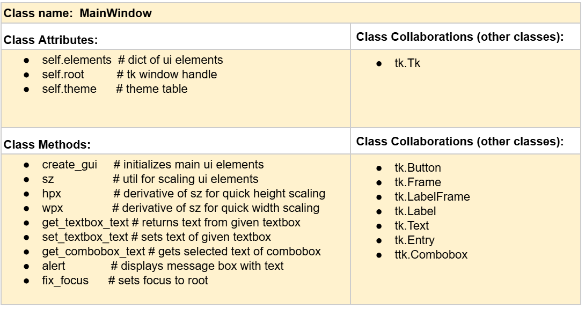
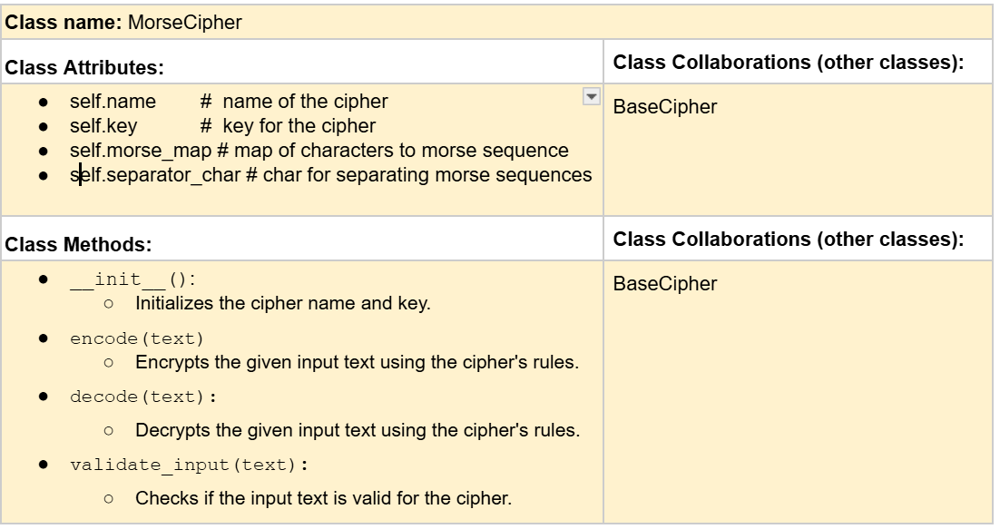
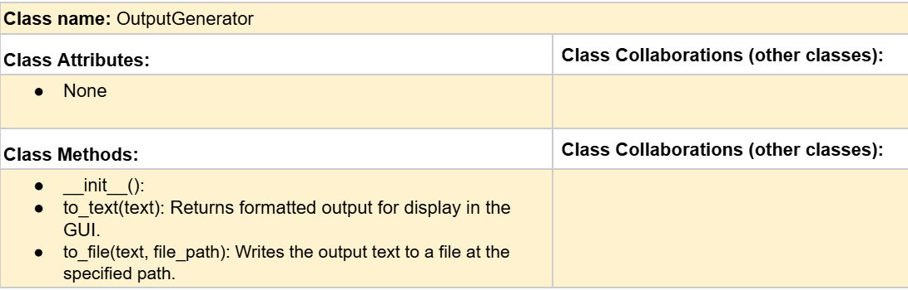
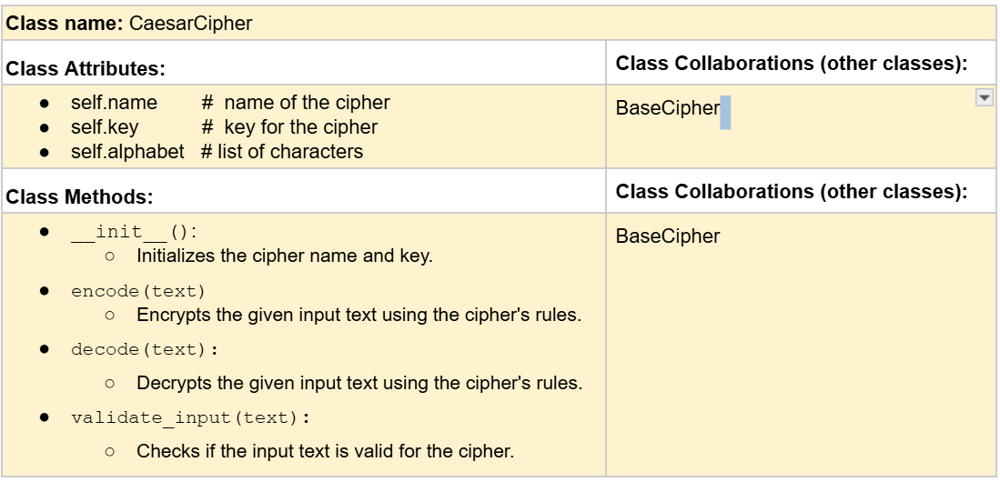
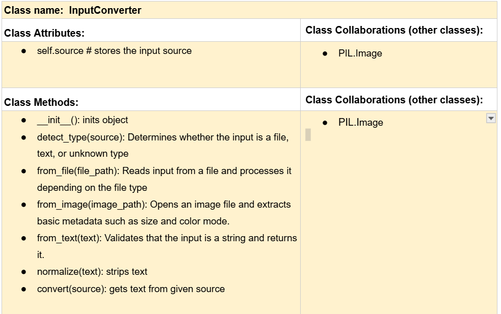

# CSC226 Final Project

## Instructions

**Author(s)**: Jayden Fleming, Alain Irumva

️**Google Doc Link**: https://docs.google.com/document/d/1PfQCP4ADzSkOFW_gapHCMgJt8FH1BvVtSwp8REpGecw/edit?usp=sharing

---

## Milestone 1: Setup, Planning, Design

️**Title**: `Cipher Tool`

**Purpose**: `GUI Cipher Tool to make encoding and decoding easy with many input/outputs types.`

**Source Assignment(s)**: `HW10 - Ciphers`

**CRC Card(s)**
Note: CRC Cards also can be found in the google-doc.








**Branches**: This project will **require** effective use of git. 

Branches:
```
    Branch 1 starting name: flemingj2
    Branch 2 starting name: irumvaa1
```

### References 

- https://docs.python.org/3/library/tkinter.html
- https://tkdocs.com/tutorial/
- https://coolors.co/palettes/trending/grey
- https://www.momjunction.com/articles/secret-ciphers-codes-for-kids_00736353/
- https://github.com/Berea-College-CSC-226/p01-final-project-finalproject-irumvaa-flemingj2-1/blob/irumvaa1/Input%20type%20detection%20guide.pdf
---

## Milestone 2: Code Setup and Issue Queue

Reflection: 
```
    We started off a little behind, but as direction of project has become cleaer and we have become more organized, 
    the timline for comepleting the project has become more manageble.
```

---

## Milestone 3: Virtual Check-In

**Completion Percentage**: `60%`

**Confidence**:
```
    Core prototype is layed out; one tactic to reduce stress in this project will be creating
    a bramch that has functionality separate from development branch.
```

---

## Milestone 4: Final Code, Presentation, Demo

### User Instructions

Notes: 
 - All elements of the UI are labeled.
 - Prompts will guide when errors occur.
 - IMPORTANT: Encode and Decode buttons always use the contents inside Input!
 - Not all ciphers require a key. (no prompt for this)

1. Run main.py
2. Select a Cipher Type via the dropdown
3. Enter a key if applicable
4. Write text to be encoded or decoded inside the input box
5. Selected your output type via the dropdown
   - 'text' will output content to output box
   - 'file' will output content to file in current directory called out_[somthing].txt
     - 'file' will display prompt with further info on execution of task
6. Press the 'encode' or 'decode' button respectively.
7. View contents inside output box or created file respectively.

### Errors and Constraints

- Not all ciphers require a key, the UI does not communicate this.
- Some issues with element focusing, but this problem is due to how tkinter works.
- SymbolCipher is not implemented
- Because of time constraints, we were not able to implement image encodings
- Due to time constraints, some configuration elements were ommited.
  - ability to change morse-code separation-char was not added
- UTF-8 is only supported format in exporting of files.

### Reflection

```
    Partner 1 (Jayden):
    For this project we selected an application that would not be too difficult but not too simple either. 
    We wanted something interesting, that we knew we could do given the time. The project we chose also allowed
    for a simple distribution of tasks which would be important in this class's case.
    The project roughly matched the initial design, but it evolved in some ways, and degraded in other qualities
    from what was envisioned.

    I learned a lot regarding layout managers in this project. I also learned about python lambda events 
    when figuring out how to have a function call another on another with certain parameters.

    The most challenging part of this project was estimating how long something would take. 
    Figuring out how to balance a mixed paradigm of functional and OOP was also difficult. 
    It isn't easy to know what model will simplify a problem the most.

    In a future project, I want to ensure I streamline the documentation phase better, in this project I felt 
    it was out of order and created unnecessary resistance.

    On the topic of my partner, I feel we worked together well. We used a combination of slack and library visits 
    along with comments under the issue-queue to complete tasks effectively.
```

```
    Partner 2 (Alain):
    I personally chose to work on this project because I felt like I was struggling in some of my classes,
    especially with programming concepts. I wanted something that would help me practice more and improve
    my understanding step by step. I also wanted to learn more about building a GUI, since that was something
    new to me. 
    This project gave me a chance to work with tools like Tkinter for the interface and Pillow for
    handling images, which helped me explore things I had not worked with before. As I worked on the project, 
    I learned a lot about how to better organize code. 
    At first, it was hard for me to understand how to break a program into smaller pieces, but using classes like
    BaseCipher, CaesarCipher, InputConverter, and OutputGenerator helped me see how each part has its own role. 
    I also learned how important it is to plan before coding. 
    When I did not plan well, I had to go back and fix things later. I also learned how to connect different parts
    of the program, especially how the GUI works with the cipher logic. One of the biggest things I learned was how
    to deal with problems and bugs. There were times when the program did not work as expected, such as issues with
    the key or switching cipher types, and I had to stop and figure out what was wrong. 
    This helped me improve my debugging skills and made me more patient. I also learned that testing is very important
    and that I should test my code more often rather than waiting until the end. This project helped me grow not only
    in coding but also in problem-solving and learning how to keep improving when things are difficult.
```

---